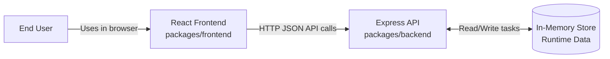
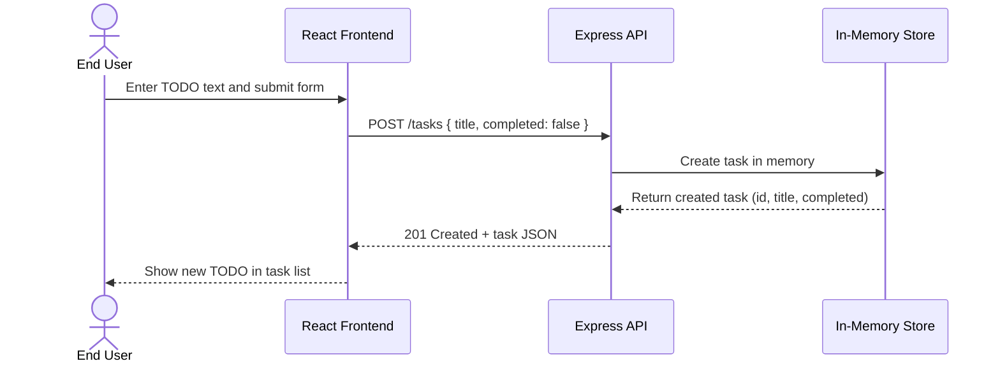

# Cloud Architecture Overview

This document provides a simple system context view of the monorepo application.

## System Context Diagram

## Create TODO Sequence

## Components

- React frontend: Single-page UI that renders tasks and sends API requests.
- Express API: Handles task endpoints and application logic.
- In-memory store: Process-local data storage used by the API (non-persistent).

## Notes

- The in-memory store resets when the backend process restarts.
- This architecture is suitable for learning and development, not production persistence.
